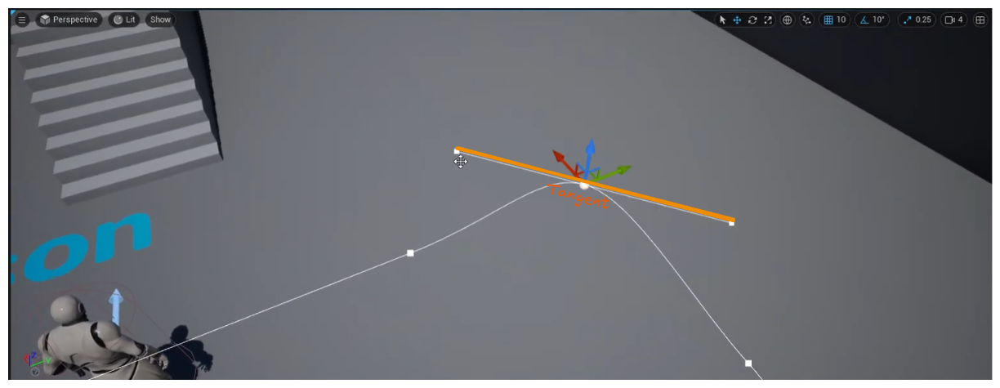
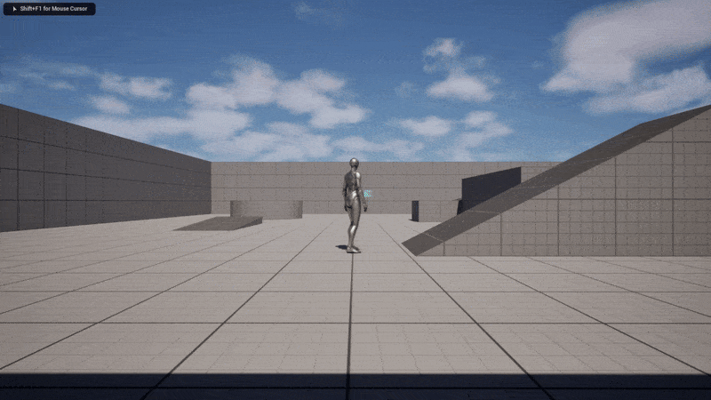

# Dynamic Side-scroller
## Player Movement
Player movement is limited to following a not linear spline as path.
It means that it can move dynamically around objects 
or through a 3D space maintains a side-scroller view.
### How it works
After reference the **Spline Actor**, Character needs to finds
the movement orientation.
At this purpose, it's used the **normalized tangent** of the closest spline's point to character.

This vector is multiplied for **input value** (`float`)  to determine whether the vector is positive or not,
and for a **scan value** that indicates magnitude and how long to following that.
This is necessary to know how the actor must be rotated to reach the next spline's point that means **vector direction**
and where it points.
All this calculation ignored Z-value because is not dependent from path, allowing a free jumping and not slowdowns when 
player has a height difference from spline. To make that is used the method `GetSafeNormal2D()`.
When spline is **not a closed loop** there could be **floating precision issues** when character reaches **boundaries**.
To fix it, before movement is calculated, actor location is checked to allows movement only in the opposite direction.

### Custom Movement Component
Player use a custom movement component that manage many features:

#### Slope
Character slow down or speed up based on floor slope.
It's used a `UCurveFloat` that determines the `MaxWalkSpeed` value
at a specific **slope**. This value is interpolated with current speed value.

**Slope** is calculated as the **Dot product** between 
the current floor impact normal and the player forward. 

#### Different Surface Types
Player has different movement settings when walk on different surfaces.
Floor static mesh own a *Physical Material* with **custom Surface Type**.
Character movement has a `TMap<TEnumAsByte<EPhysicalSurface>, FSurfaceSettings>` 
that allows to edit in Blueprint specific Movement Settings for every **Surface Type**.
During `PhysWalking` simulation are set relative settings at every Surface Type changes.

For optimization `TMap` is not used at runtime, but data copy are stored in a `TArray`, using key to index.
This `TArray` is built in `InitComponent` and **Map** is deallocated. 

## Sidescroller camera 
Activating the `bkeepSidescrollerView` in _Character Blueprint settings_
or managing it at **runtime**, Camera will have a fixed Sidescroller view.

### How it works
`CameraBoom` is attached to a `CameraPivot` (`USceneComponent`).
It has same Character rotation when moves **forward** 
and flips 180° when moves **backward**, 
using **Absolute Rotation** for a manual management.

First pass, getting **Target Rotation** as `FQuat`,
to avoid jittering and worthless rotation issues.

After that, using **Slerp** for a smooth rotation
and update Pivot and Spring Arm rotation, applying its offset.

